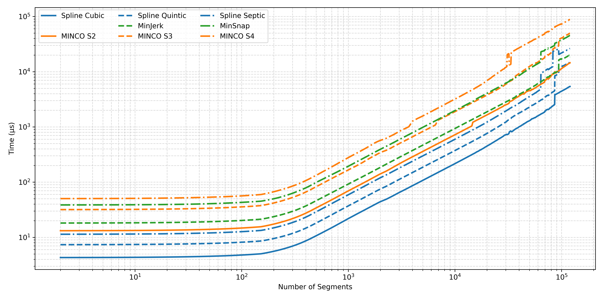
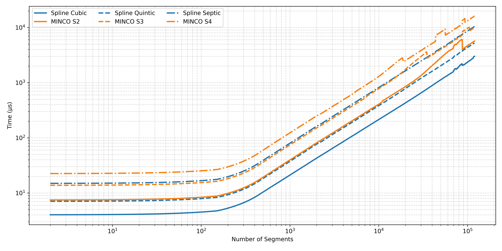
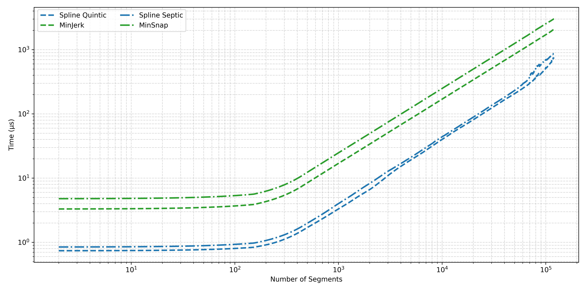

# SplineTrajectory

Header-only C++ library for smooth N-dimensional minimum-control-effort spline trajectories. It is mathematically equivalent to [MINCO](https://github.com/ZJU-FAST-Lab/GCOPTER), with an O(N) block-tridiagonal solver, full-parameter gradient propagation, analytic energy gradients, and a componentized optimizer interface for cubic, quintic, and septic splines.

**English** | [中文](README_SplineTrajectory_ZH.md)

## ✨ Overview

Core capabilities:

- cubic, quintic, and septic minimum-control-effort splines
- O(N) trajectory construction based on a block-tridiagonal solver
- adjoint-based gradient propagation for time segments, spatial points, and boundary states
- an analytic gradient path for energy terms based on Hamiltonian conservation and variational derivation
- a generic `SplineOptimizer` with component-style interfaces for time maps, spatial maps, costs, and auxiliary variables

Spline families and their MINCO counterparts:

| Spline Type | Polynomial Degree | Minimizes | MINCO Equivalent |
| --- | --- | --- | --- |
| Cubic | 3rd order | Acceleration | MINCO S2 |
| Quintic | 5th order | Jerk | MINCO S3 |
| Septic | 7th order | Snap | MINCO S4 |

## 🔁 Gradient Propagation

🔁 Adjoint gradients are available for the main control parameters of the spline problem:

- time segments `T`
- spatial points `P`
- start and end boundary states, including velocity, acceleration, and jerk when applicable

At the low level, `propagateGrad(gdC, gdT)` maps gradients on spline coefficients and segment times back to these control parameters.

For optimization tasks, `SplineOptimizer` exposes a higher-level interface. For most integral costs, the cost is written on sampled trajectory states, and the optimizer:

- perform numerical integration
- assemble gradients with respect to spline coefficients `C` and segment times `T`
- propagate them further to time variables, spatial points, boundary states, and optional auxiliary variables

In typical use, this reduces the user-side interface to local gradients with respect to sampled `p / v / a / j`, with optional `s` and explicit global-time terms when needed.

## ⚡ Analytic Energy Gradients

⚡ For pure energy terms, SplineTrajectory also provides a separate analytic gradient path derived from Hamiltonian conservation and variational derivation.

Main results:

- time gradients can be obtained in O(1) from segment boundary information
- waypoint gradients can be constructed from jumps in the highest-order derivative at junctions

Energy optimization therefore does not need to first form partials with respect to `C` and `T` and then send them through the adjoint route. For energy-only problems, this path is faster than the general back-propagation pipeline.

## 🧩 SplineOptimizer

🧩 `SplineOptimizer` is a generic optimizer built on top of the spline and gradient infrastructure. Its interfaces are organized around reusable components:

- `TimeMap` for mapping unconstrained variables to positive physical durations
- `SpatialMap` for mapping unconstrained variables to physical points, corridors, or polytope-constrained states
- integral, waypoint, and whole-trajectory cost interfaces
- `AuxiliaryStateMap` for additional low-dimensional optimization variables that affect the spline state
- direct integration with L-BFGS and similar optimizers

This organization keeps penalty definitions close to physical state space, while time mapping, spatial mapping, integral assembly, and gradient propagation stay inside the optimizer.

## 📌 Comparison with MINCO

SplineTrajectory solves the same spline problem as MINCO. The main differences are in implementation efficiency and interface design:

| Feature | SplineTrajectory | MINCO |
| --- | --- | --- |
| Algorithm | Block Tridiagonal Solver (Thomas) | LU Decomposition |
| Construction Speed | Faster | Baseline |
| Gradient Propagation | Faster (cached factorization reuse) | Baseline |
| Energy Gradient | Analytic + Adjoint | Adjoint only |
| Boundary State Gradient | Included | Not provided |
| Optimizer Cost API | Local-state gradients -> auto `dL/dC`, `dL/dT` | Not built in |
| Dimensions | Arbitrary (templated) | Fixed 3D |
| Evaluation | Segmented batch with coefficient caching | Standard |

SplineTrajectory also outperforms [large_scale_traj_optimizer](https://github.com/ZJU-FAST-Lab/large_scale_traj_optimizer) in both trajectory construction and evaluation.

## 📈 Benchmarks

📈 Trajectory Construction Speed (2 to 10^5 segments)



📈 Gradient Back-propagation Speed (2 to 10^5 segments)



📈 Analytic Energy Gradient Speed (2 to 10^5 segments)



## 🛠️ Refactored Projects

🛠️ The following planners have been refactored with SplineTrajectory and SplineOptimizer:

| Project | Description | Original | Refactored |
| --- | --- | --- | --- |
| **EGO-Planner-v2** | Multicopter swarm planning (Science Robotics) | [ZJU-FAST-Lab](https://github.com/ZJU-FAST-Lab/EGO-Planner-v2) | [Refactored](https://github.com/Bziyue/EGO-Planner-v2) |
| **GCOPTER** | Geometrically constrained trajectory optimization (IEEE T-RO) | [ZJU-FAST-Lab](https://github.com/ZJU-FAST-Lab/GCOPTER) | [Refactored](https://github.com/Bziyue/GCOPTER) |
| **SUPER** | Safety-assured high-speed MAV navigation (Science Robotics) | [HKU-MaRS](https://github.com/hku-mars/SUPER) | [Refactored](https://github.com/Bziyue/SUPER) |
| **DDR-opt** | Universal trajectory optimization for differential-drive robots (IEEE T-ASE) | [ZJU-FAST-Lab](https://github.com/ZJU-FAST-Lab/DDR-opt) | [Refactored](https://github.com/Bziyue/DDR-opt) |

Across these refactors, costs are written on physical states, while time mapping, spatial mapping, integral assembly, and gradient propagation are handled by the shared optimizer framework. DDR-opt further uses whole-trajectory costs and auxiliary-state variables for coupled optimization problems.

## 📦 Requirements

- C++11 or later
- Eigen 3.3 or later
- CMake 3.10+ for examples and tests

## 🚀 Quick Start

🚀

```bash
git clone https://github.com/Bziyue/SplineTrajectory.git
cd SplineTrajectory

# Install Eigen3 if needed
sudo apt install libeigen3-dev

# Build
mkdir build && cd build
cmake ..
make

# Performance tests
./test_cubic_spline_vs_minco_nd
./test_quintic_spline_vs_minco_nd
./test_septic_spline_vs_minco_nd

# Gradient tests
./test_Grad
./test_cost_grad
./test_bc_grad
```

For a complete motion-planning toolkit built around this library, see [ST-opt-tools](https://github.com/MarineRock10/ST-opt-tools), which integrates ESDF mapping, A* path planning, and L-BFGS trajectory optimization.

## 🧰 Main Features

### 🛤️ Trajectory Construction

- construct splines from time points or time segments with boundary conditions
- use default zero-derivative boundaries or fully custom clamped boundaries
- update an existing spline efficiently through `update()`

### 📍 Evaluation

- single-point, batch, and range-based evaluation for position and all supported derivatives
- segmented batch evaluation with per-segment coefficient caching
- derivative trajectory extraction as standalone polynomial trajectories

### 🔁 Gradients

- `propagateGrad(gdC, gdT)` for gradients defined on coefficients and times
- `SplineOptimizer::evaluate(...)` for integral costs defined on sampled trajectory states
- `getEnergyGradInnerP()` and `getEnergyGradTimes()` for analytic energy gradients
- `getEnergyPartialGradByCoeffs()` and `getEnergyPartialGradByTimes()` for energy partials
- boundary-state gradients for start and end derivatives

### 📐 Trajectory Analysis

- trajectory length over the full curve or a subrange
- cumulative arc length at any time
- energy computation

## ✅ Gradient Verification

✅ The repository includes dedicated tests for gradient verification:

- `test_Grad` checks propagated energy gradients against analytic results
- `test_cost_grad` checks integrated and propagated arbitrary costs against finite differences
- `test_bc_grad` checks boundary-state gradients

These tests verify consistency among the adjoint path, the analytic path, and numerical checks.

## 📚 Documentation

See the `examples/` directory for usage examples covering construction, evaluation, gradient propagation, and optimizer integration.

## 🔭 Future Plans

- [x] MINCO-equivalent gradient propagation
- [x] Clamped septic spline support
- [ ] N-dimensional non-uniform B-spline support
- [ ] Exact conversion from clamped splines to non-uniform B-splines

## 📄 License

MIT License. See [LICENSE](LICENSE) for details.

## 🙏 Acknowledgments

- [Eigen](http://eigen.tuxfamily.org/) for linear algebra
- [MINCO](https://github.com/ZJU-FAST-Lab/GCOPTER) for the original formulation context
- classical spline interpolation theory and the minimum norm viewpoint
